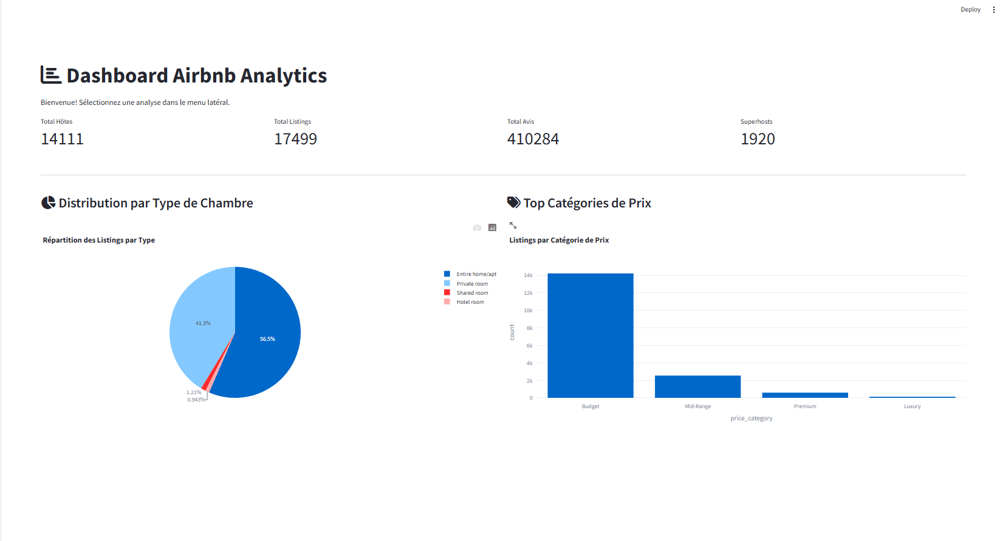
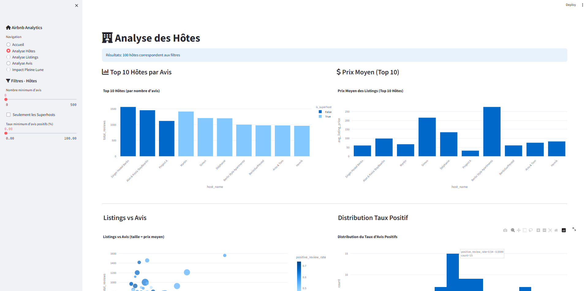
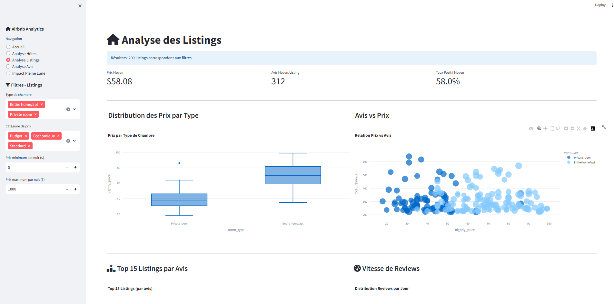
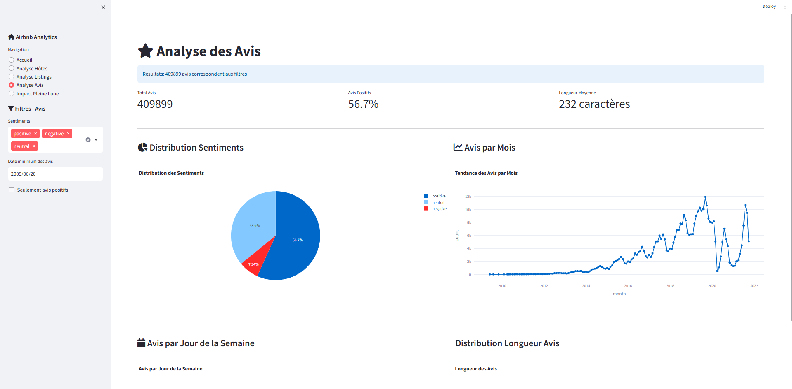
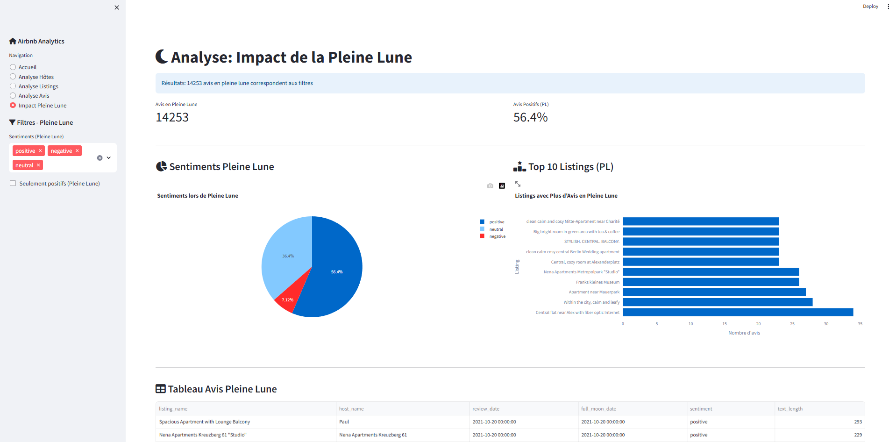

<link rel="stylesheet" href="https://cdnjs.cloudflare.com/ajax/libs/font-awesome/6.4.0/css/all.min.css">

# <i class="fas fa-building"></i> Plateforme d'Analyse Airbnb - Rapport Complet

**Auteurs** : Frédo AGBEKODO, Heriol Zeufack
**Date** : 2026-06-14  

---

## <i class="fas fa-users"></i> ÉQUIPE PROJET

### Répartition des Rôles et Responsabilités

| Rôle | Responsabilités |
|------|-----------------|
| **Frédo AGBEKODO, Heriol Zeufack** | • Architecture dbt (Bronze/Silver/Gold)<br>• Création des 12 modèles SQL<br>• Configuration DuckDB<br>• Pipelines de données<br>• Chargement des seeds |
| **Frédo AGBEKODO** | • Requêtes SQL avancées<br>• Transformation des données (Silver)<br>• Logique métier<br>• Agrégations analytiques (Gold)<br>• Optimisation requêtes |
| **Heriol Zeufack** | • Application Streamlit (5 pages)<br>• Interface utilisateur<br>• Filtres dynamiques<br>• Navigation et layout<br>• Mise en cache Streamlit |
| **Frédo AGBEKODO, Heriol Zeufack** | • Graphiques Plotly (4+)<br>• Dashboards interactifs<br>• Design UX/UI<br>• Chartjs et couleurs<br>• KPI et métriques |
| **Heriol Zeufack** | • Tests dbt (déclaratifs + custom)<br>• Validation des données<br>• UAT (User Acceptance Testing)<br>• Assurance qualité |

---

## <i class="fas fa-clipboard"></i> PRÉSENTATION DU PROJET

La **Plateforme d'Analyse Airbnb** est une solution analytique complète intégrant **Streamlit** (interface), **dbt** (transformation), et **DuckDB** (stockage), conçue pour explorer et visualiser les données Airbnb en temps réel.

### <i class="fas fa-bullseye"></i> Objectifs
- <i class="fas fa-chart-bar"></i> **Analyser les données Airbnb** : Exploiter les données de 410K+ avis
- <i class="fas fa-search"></i> **Filtrer et explorer dynamiquement** : Interface interactive avec filtres multiples
- <i class="fas fa-chart-line"></i> **Générer des visualisations pertinentes** : 4+ graphiques Plotly interactifs
- <i class="fas fa-moon"></i> **Étudier l'impact de la pleine lune** : Analyse spécifique de l'influence lunaire

---

## <i class="fas fa-star"></i> FONCTIONNALITÉS PRINCIPALES

### <i class="fas fa-check"></i> Analyse Complète des Données
- **Avis** analysés et visualisés en temps réel
- **Listings** avec détails complets (type, prix, localisation)
- **Hôtes** avec métriques agrégées

### <i class="fas fa-filter"></i> Filtres Dynamiques et Interactifs
- Filtres par sentiments (Positif, Négatif, Neutre)
- Sélection de plage de dates flexible
- Filtres par type de listing (Entire home, Private room, etc.)
- Filtres par fourchette de prix
- Mise en cache intelligente pour performance optimale

### <i class="fas fa-calculator"></i> KPI et Métriques Clés
- **Nombre total d'avis** avec filtrage en temps réel
- **Pourcentage d'avis positifs** dynamiquement calculé
- **Longueur moyenne des avis** avec histogramme
- **Taux de réponse des hôtes** avec agrégations
- **Prix moyen par listing** par quartier
- **Nombre de listings par hôte** avec statistiques

### <i class="fas fa-moon"></i> Analyse Lunaire Spéciale
- **Comparaison sentiments** : pleine lune vs autres jours
- **Impact statistique** de la pleine lune sur les avis
- **Corrélations** entre cycle lunaire et satisfaction clients

### <i class="fas fa-database"></i> Architecture Données 
- **Bronze Layer** : Données brutes (4 seeds CSV)
- **Silver Layer** : Données nettoyées et transformées
- **Gold Layer** : Données analytiques prêtes pour BI
- **Tests de qualité** : couverture avec dbt

---

## <i class="fas fa-rocket"></i> INSTALLATION ET EXÉCUTION

### Prérequis
```
Python 3.10+
dbt-core 1.5+
DuckDB 0.8+
Streamlit 1.28+
Plotly 5.17.0+
```

### Instructions d'installation et d'exécution

**1. Cloner et préparer**
```bash
git clone https://github.com/heriol-valdo/Airbnb-Analytics-Platform
cd Airbnb-Analytics-Platform
pip install -r requirements.txt
```

**2. Charger les données dbt**
```bash
cd airbnb_analytics
dbt seed          # Charger les CSV
dbt run           # Exécuter les modèles
```

**3. Lancer l'application**
```bash
streamlit run streamlit_app.py
```

**Accès** : http://localhost:8501 <i class="fas fa-check-circle"></i>

---

## <i class="fas fa-tasks"></i> TÂCHES EFFECTUÉES

### Phase 1 : Architecture et Configuration 
- [x] Mise en place du repository Git
- [x] Configuration initiale dbt avec DuckDB
- [x] Structure Bronze/Silver/Gold définie
- [x] Chargement des données seed (4 CSV)

### Phase 2 : Transformation des Données 

**Couche Bronze** (4 seeds)
- [x] listings.csv →  listings
- [x] reviews.csv → avis
- [x] hosts.csv → hôtes
- [x] full_moon_dates.csv → dates lunaires

**Couche Silver** (4 modèles de transformation)
- [x] fct_silver_listings.sql - Nettoyage listings
- [x] fct_silver_reviews.sql - Avis avec sentiments
- [x] fct_silver_hosts.sql - Hôtes enrichis
- [x] fct_silver_full_moon_dates.sql - Dates lunaires

**Couche Gold** (4 modèles analytiques)
- [x] fct_gold_fact_reviews.sql - Faits avis
- [x] fct_gold_fact_full_moon_reviews.sql - Impact lunaire
- [x] fct_gold_dim_listings.sql - Dimension listings
- [x] fct_gold_dim_hosts.sql - Dimension hôtes

### Phase 3 : Application Streamlit 
- [x] Page 1: **Accueil** - KPI généraux
- [x] Page 2: **Analyse Hôtes** - Filtres et métriques
- [x] Page 3: **Analyse Listings** - Propriétés et prix
- [x] Page 4: **Analyse Avis** - 4 visualisations
- [x] Page 5: **Impact Pleine Lune** - Analyse spéciale

### Phase 4 : Vérification des resultats avec DBT 
- [x] **Tests** 
  - test_listing_host_relationship.sql 
  - test_reviews_date_range.sql 

- [x] **Exécution** :
    ```bash
    cd airbnb_analytics
    dbt test
    ```

- [x] **Résultats**
  ```
    00:37:35  Completed successfully
    00:37:35  
    00:37:35  Done. PASS=2 WARN=0 ERROR=0 SKIP=0 NO-OP=0 TOTAL=2
  ```

---

## <i class="fas fa-palette"></i> VISUALISATIONS STREAMLIT

### <i class="fas fa-home"></i> Page 1 : Accueil


**Contenu** :
- KPI généraux (total listings, avis, hôtes)
- Liens vers les autres pages

---

### <i class="fas fa-users"></i> Page 2 : Analyse Hôtes


**Contenu** :
- Filtres dynamiques sur les hôtes
- Tableau des hôtes avec métriques

---

### <i class="fas fa-house"></i> Page 3 : Analyse Listings


**Contenu** :
- Filtres : type, prix, avis
---

### <i class="fas fa-comments"></i> Page 4 : Analyse Avis (4 Visualisations)


**Contenu** :

**Filtres** :
- Distribution sentiments (positive, negative, neutral)
- Avis par mois

**KPI** :
- Nombre total d'avis 
- Pourcentage positif : % d'avis avec sentiment positif
- Longueur moyenne : Caractères moyens par avis
---

### <i class="fas fa-moon"></i> Page 5 : Impact Pleine Lune


**Contenu** :
- Comparaison sentiments : pleine lune vs autres jours
- Statistiques corrélatives sur l'influence lunaire
- Graphiques comparatifs
- Insights et interprétations
- Nombre d'avis en pleine lune vs autres jours

---

## <i class="fas fa-building"></i> ARCHITECTURE TECHNIQUE

### Architecture en Couches (dbt)

```
CSV Files (Données Brutes)
    ↓
dbt seed (Chargement)
    ↓
BRONZE LAYER (Données Brutes)
├── stg_bronze_listings 
├── stg_bronze_reviews 
├── stg_bronze_hosts
└── stg_bronze_seed_full_moon_dates
    ↓ dbt run
SILVER LAYER (Nettoyage & Validation)
├── fct_silver_listings (nettoyage, validation)
├── fct_silver_reviews (avis + sentiments)
├── fct_silver_hosts (enrichissement)
└── fct_silver_full_moon_dates
    ↓ dbt test
    ↓ dbt run
GOLD LAYER (Analytics & BI)
├── fct_gold_fact_reviews (faits avis)
├── fct_gold_fact_full_moon_reviews (impact lunaire)
├── fct_gold_dim_listings (dimension)
└── fct_gold_dim_hosts (dimension)
    ↓
DuckDB (main_gold schema)
    ↓
Streamlit Frontend
    ↓
Utilisateur Final <i class="fas fa-check-circle"></i>
```

## <i class="fas fa-folder"></i> STRUCTURE DU PROJET

```
Airbnb-Analytics-Platform/
├── README.md                              ← Ce fichier 
├── requirements.txt                       ← Dépendances Python
├── streamlit_app.py                       ← Application principale
├── dbt_project.yml                        ← Configuration dbt
│                            
│
├── assets/                                ← Images des pages Streamlit
│   ├── 01_page_accueil.png
│   ├── 02_analyse_hotes.png
│   ├── 03_analyse_listings.png
│   ├── 04_analyse_avis.png
│   └── 05_impact_pleine_lune.png
│
└── airbnb_analytics/                      ← Projet dbt
    ├── models/
    │   ├── bronze/                        ← Données brutes
    │   │   ├── stg_bronze_seed__listings.sql
    │   │   ├── stg_bronze_seed__reviews.sql
    │   │   ├── stg_bronze_seed__hosts.sql
    │   │   └── stg_bronze_seed__full_moon_dates.sql
    │   │
    │   ├── silver/                        ← Données transformées
    │   │   ├── fct_silver_listings.sql
    │   │   ├── fct_silver_reviews.sql
    │   │   ├── fct_silver_hosts.sql
    │   │   └── fct_silver_full_moon_dates.sql
    │   │
    │   └── gold/                          ← Données analytiques
    │       ├── fct_gold_fact_reviews.sql
    │       ├── fct_gold_fact_full_moon_reviews.sql
    │       ├── fct_gold_dim_listings.sql
    │       └── fct_gold_dim_hosts.sql
    │
    ├── tests/                             ← Tests 
    │   ├── test_listing_host_relationship.sql 
    │   └── test_reviews_date_range.sql        
    │
    ├── seeds/                             ← Données brutes CSV
    │   ├── listings.csv
    │   ├── reviews.csv
    │   ├── hosts.csv
    │   └── full_moon_dates.csv
    │
    └── dev.duckdb                        ← Base de données DuckDB
```


